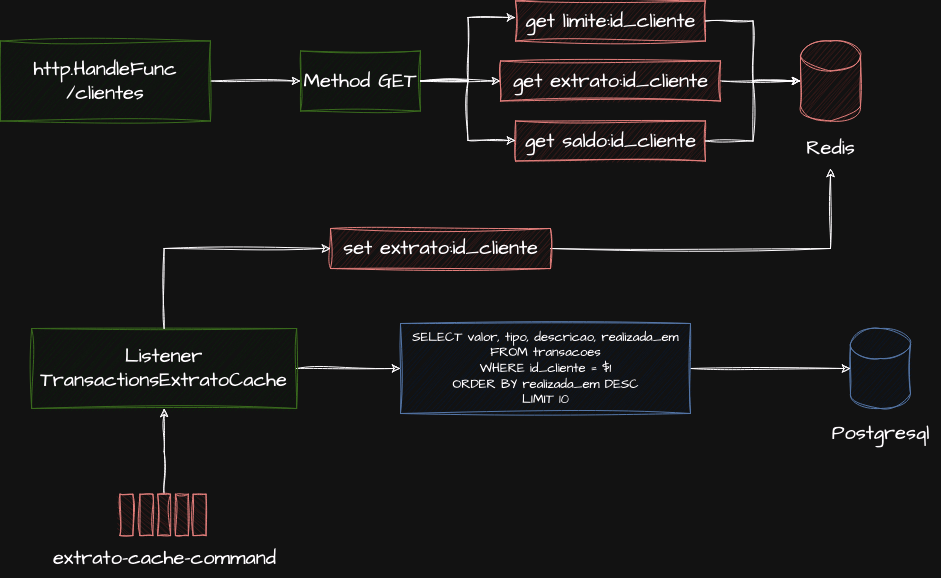

# Projeto da Rinha de Backend 2024 - Otimizações de Escrita e Leitura com Cache Write-Behind e Commands assincronos. 

## Tecnologias Utilizadas

| Tecnologia  | Versão  | Descrição                                             |
|-------------|---------|-------------------------------------------------------|
| Envoy Proxy | v1.29.1 | Usado como proxy reverso e load balancer.             |
| Golang      | 1.21    | Linguagem de programação para o backend.              |
| Redis       | 7.2.4   | Armazenamento em cache para otimização.               |
| Postgres    | 16      | Banco de dados relacional para persistência de dados. |

## Padrões Utilizados

### Lazy Writing (Write-Behind)

O padrão Lazy Writing (Write-Behind) foi utilizado para otimizar as operações de escrita no banco de dados. Com esse padrão, as operações de escrita são primeiro aplicadas a um sistema de cache rápido (neste caso, Redis), e então, de forma assíncrona, essas mudanças são consolidadas no banco de dados principal (PostgreSQL). Esse padrão ajuda a:

- Reduzir a carga no banco de dados principal, distribuindo as operações de escrita ao longo do tempo.
- Melhorar a resposta ao usuário, pois as operações de escrita são concluídas mais rapidamente no cache.

#### Contras encontrados 

Ao estudar a implementação do Write-Behind, os desafios encontrados foram a necessidade de construção de diversos processos em backgroud para manter a camada de consistência confiável. 

### HttpFunc do Go

Para o servidor HTTP, foi utilizado o `http.HandlerFunc` padrão do Go, aproveitando a simplicidade e eficiência da biblioteca padrão de HTTP do Go para criar endpoints da API.

### Escrita

No projeto, a abordagem de escrita e leitura de transações financeiras (créditos/débitos) é cuidadosamente projetada para otimizar a performance e garantir a consistência dos dados. Abaixo está uma explicação detalhada do processo:

Inicialmente, ao receber uma solicitação de transação, o sistema verifica a existência do cliente diretamente no cache, um passo crucial para reduzir a latência e evitar consultas desnecessárias ao banco de dados principal.

Segue-se a checagem das informações de limite do cliente, também armazenadas em cache, garantindo uma rápida validação das transações sem comprometer os limites estabelecidos para cada cliente. Uma vez que a existência e o limite do cliente são confirmados, as operações de crédito ou débito são executadas. Essas operações levam em consideração o limite de crédito disponível, procedendo com a transação somente se o novo saldo não ultrapassar este limite.

#### TransactionsLazyWritting - Write Behind das transações

Após a aprovação da transação com base nas verificações em cache, o sistema realiza a operação em cache e emite uma mensagem de comando para o listener `TransactionsLazyWritting`. Este listener tem a responsabilidade de persistir as transações de forma assíncrona no banco de dados PostgreSQL, assegurando que a experiência do usuário permaneça fluida e responsiva, enquanto as transações são devidamente registradas em segundo plano.

Além disso, o TransactionsLazyWritting estimula mais dois listeners secundários: `TransactionsExtratoCache` e `TransactionsSaldoLazyWriter`. 

#### TransactionsExtratoCache - Offload das ultimas 10 transações

O listener `TransactionsExtratoCache` atualiza o cache com as últimas 10 transações do cliente, garantindo que informações frequentemente acessadas estejam sempre prontamente disponíveis. 

#### TransactionsSaldoLazyWriter - Write Behind do Cache

O segundo, atualiza o saldo do cliente em cache e, posteriormente, sincroniza essa atualização com a tabela de saldo oficial no PostgreSQL. 

### Leitura / Extrato

As operações de leitura somente consultam os dados que são resultantes das operações assincronas do Write Behind e update do saldo. 

