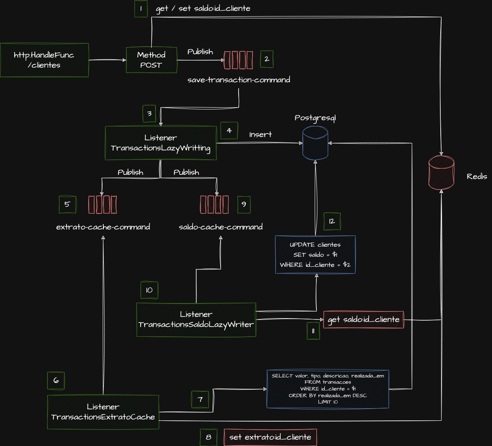

## Tecnologias Utilizadas

| Tecnologia  | Versão  | Descrição                                             |
|-------------|---------|-------------------------------------------------------|
| Envoy Proxy | v1.29.1 | Usado como proxy reverso e load balancer.             |
| Golang      | 1.21    | Linguagem de programação para o backend.              |
| Redis       | 7.2.4   | Armazenamento em cache para otimização.               |
| Postgres    | 16      | Banco de dados relacional para persistência de dados. |

## Padrões Utilizados

### Lazy Writing (Write-Behind)

O padrão Lazy Writing (Write-Behind) foi utilizado para otimizar as operações de escrita no banco de dados. Com esse padrão, as operações de escrita são primeiro aplicadas a um sistema de cache rápido (neste caso, Redis), e então, de forma assíncrona, essas mudanças são consolidadas no banco de dados principal (PostgreSQL). Esse padrão ajuda a:

- Reduzir a carga no banco de dados principal, distribuindo as operações de escrita ao longo do tempo.
- Melhorar a resposta ao usuário, pois as operações de escrita são concluídas mais rapidamente no cache.

#### Contras encontrados 

Ao estudar a implementação do Write-Behind, os desafios encontrados foram a necessidade de construção de diversos processos em backgroud para manter a camada de consistência confiável. 

### HttpFunc do Go

Para o servidor HTTP, foi utilizado o `http.HandlerFunc` padrão do Go, aproveitando a simplicidade e eficiência da biblioteca padrão de HTTP do Go para criar endpoints da API.

### Escrita

### Leitura / Extrato

